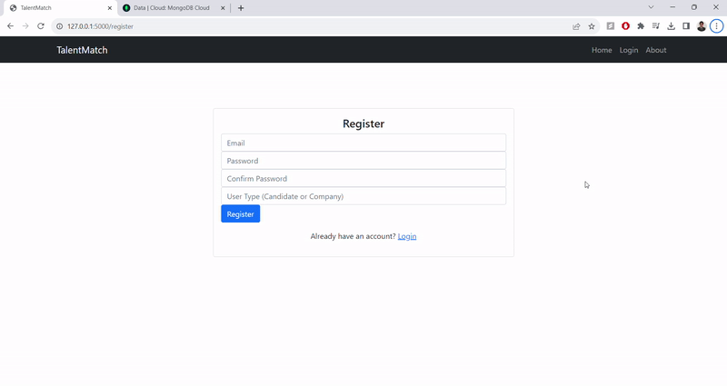
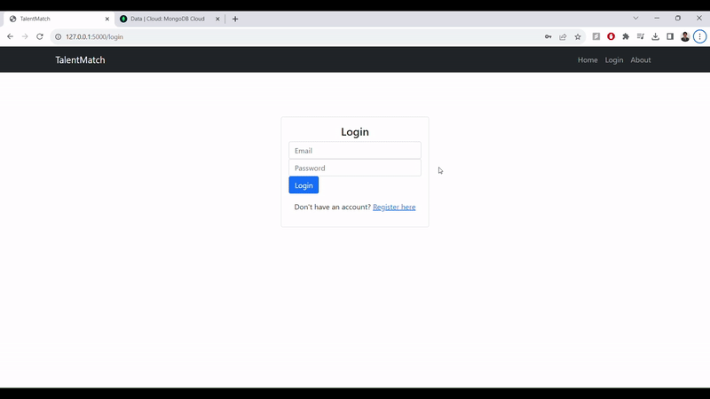
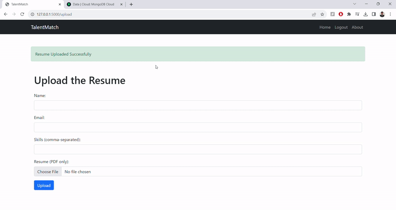
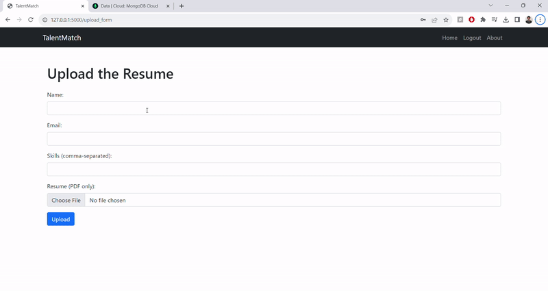
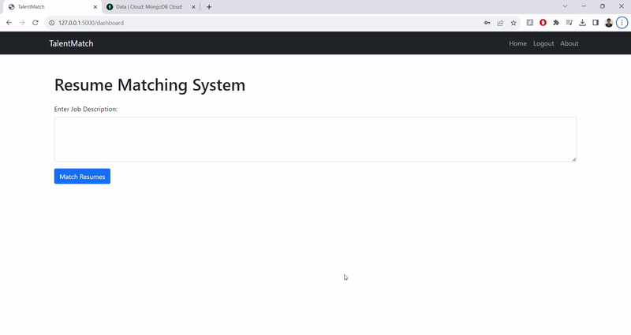
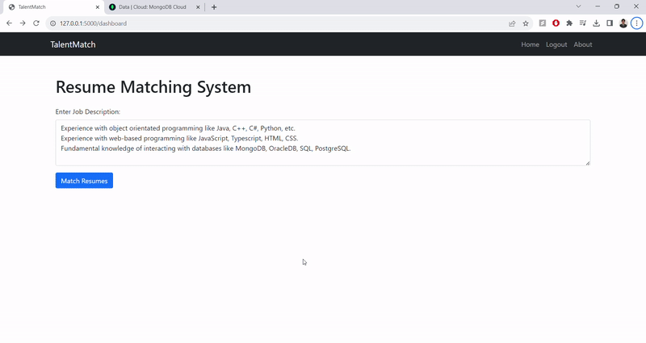

# TalentMatch: Resume-Job Matching Platform

TalentMatch provides a seamless interface for companies and candidates, streamlining the process of resume and job description matching through advanced NLP techniques.

## Features

### Main Menu

- Easy Navigation to different sections like login, about page, registration page, and access multiple articles.
- Simple and intuitive interface

### User Authentication

- Secure user registration and login
- Password encryption

  

- **Candidate Registration:**
  - Candidates can securely register on the platform.
  
- **Company Registration:**
  - Companies can register to post job descriptions and find matching resumes.

### User Login

- **Candidate Login:**

  - Secure login for candidates to upload resumes.
  
  
  
- **Company Login:**

  - Secure login for companies to post job descriptions and find matching resumes.
  
  
  
### For Candidates

- **Resume Upload:**

  - After logging in, candidates can easily upload their resumes in PDF format.
  
  

### For Companies

- **Job Description Entry:**
  - Companies can enter job descriptions to find the best matching resumes after logging in.

- **Resume Matching:**
  - Fine Tuned the base spacy english model (en_core_web_sm) to enable to extract all technological keywords.
  - The system extracts technical keywords from job descriptions, matching them with skills listed in candidates' resumes stored in MongoDB. Candidates with the highest overlap of skills are listed in descending order. Companies can then view and download the resumes of matched candidates.

**Example 1**

- User with most overlap of skills is listed first.
- User with no overlap is not listed.

**Example 2**

- Users with no overlap are not listed/

## Tech Stack
- **Back-End:**
  - Flask: Python-based micro web framework used to serve the application.
  - MongoDB: NoSQL database used to store user data and resumes.
  - SpaCy: Library for advanced Natural Language Processing used to fine tune current base model so that it can extract keywords from job descriptions.

- **Front-End:**
  - HTML5: Markup language used for structuring and presenting content.
  - CSS3: Style-sheet language used for describing the look and formatting of the document.

- **Infrastructure:**
  - GitHub: Platform used for version control and collaborative development of the project.

## Conclusion
TalentMatch is a robust platform designed to efficiently connect companies with potential candidates by automating the process of matching resumes with job descriptions. Its intuitive interface and secure authentication system provide a user-friendly experience while the sophisticated NLP algorithms ensure accurate and relevant matching, making TalentMatch an invaluable tool for both recruiters and job seekers in the tech industry.

## Contributing
Your contributions are always welcome! Feel free to improve existing features, documentation, or add new features. Please open an issue to propose your changes if they are substantial.
